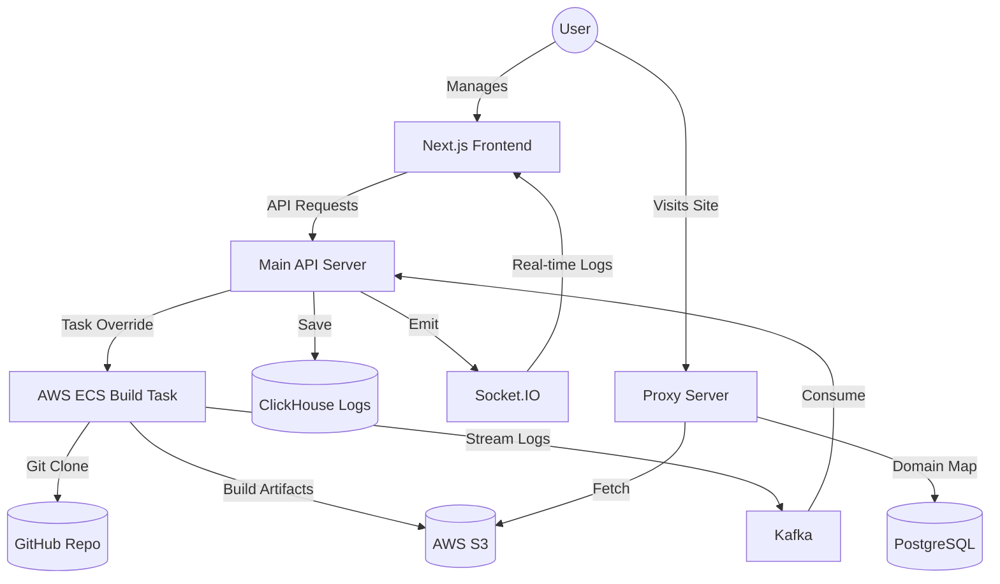

# 🚀 StackTiler: Managed Web Deployment System

A production-grade, scalable deployment platform (similar to Vercel/Netlify) specifically designed for high-performance React/Vite applications. This system automates the entire lifecycle from GitHub cloning and building to artifact storage and dynamic request proxying.

---

## 🏗️ System Architecture

StackTiler is built on a decoupled, microservice-inspired architecture to ensure reliability and independent scalability.



### Core Components
- **Main Server (Port 4000)**: The brain of the system. Handles project management, user orchestration, and deployment triggers via AWS ECS. Consumes Kafka logs for persistence.
- **Build Server (ECS Task)**: Transient compute workers created per deployment. Isolates the build process, preventing resource contention.
- **Proxy Server (Port 7000)**: A high-performance dynamic router that maps wildcard subdomains to specific S3 object folders without exposing storage URLs.
- **Frontend Client (Port 3000)**: A premium Next.js dashboard for real-time log monitoring and deployment management.

---

## 🛠️ Tech Stack

- **Frontend**: Next.js, Tailwind CSS, Shadcn UI, Socket.IO Client.
- **Backend APIs**: Node.js, Express.js.
- **Message Bus**: Apache Kafka (Log streaming).
- **Persistence**: 
  - **PostgreSQL (Prisma)**: Metadata & Project relationship.
  - **ClickHouse**: High-volume, high-performance immutable logging.
- **Infrastructure**: AWS (ECS, S3, ECR), Docker.

---

## 🚀 Getting Started

### 1. Prerequisites
- **Docker & Docker Compose**
- **Node.js 18+**
- **AWS Account** (ECS Cluster and S3 Bucket created)
- **Kafka Instance** (Upstash or local)
- **ClickHouse Instance**

### 2. Environment Configuration
The system is now fully externalized. Copy the example configuration to your environment:

```bash
cp .env.example .env
```

Open `.env` and fill in your specific credentials for AWS, Kafka, and your databases. 

> [!IMPORTANT]
> Ensure `NEXT_PUBLIC_` variables match your local/production ports for the frontend to communicate with the backend.

### 3. Local Installation

```bash
# Install dependencies for all services
cd main-server && npm install && cd ..
cd build-server && npm install && cd ..
cd proxy && npm install && cd ..
cd client && npm install && cd ..
```

### 4. Running the System

You can run services individually for development:

**Main Server & Socket Server:**
```bash
cd main-server && npm run dev
```

**Proxy Server:**
```bash
cd proxy && npm run dev
```

**Client Dashboard:**
```bash
cd client && npm run dev
```

---

## 📖 Usage Guide

1.  **Sign In**: Authenticate via the dashboard.
2.  **Create Project**: Provide a GitHub Repository URL and a project name. The system will automatically generate a unique subdomain slug.
3.  **Deploy**: Hit the "Deploy" button. stackTiler will:
    - Launch an AWS ECS Fargate task with your repo URL.
    - Start streaming real-time build logs via Kafka to your dashboard.
    - Compile the project and upload the `dist` folder to S3.
4.  **Visit**: Once the deployment is "Ready", click the generated link. The Proxy server will serve your site directly from S3.

---

## ⚠️ Current Limitations
- **Framework Support**: Currently optimized for React/Vite applications (expects a `dist` output folder).
- **Build Script**: Defaults to `npm run build`.

---

## 🛡️ License
Distributed under the MIT License. See `LICENSE` for more information.
